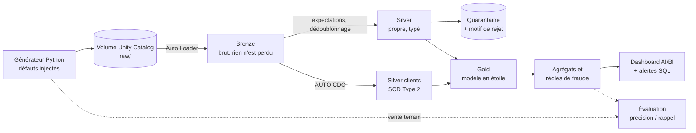

# Plateforme de données fintech sur Databricks


Plateforme data de bout en bout pour une société de paiement mobile simulée : des fichiers bruts et
imparfaits arrivent en continu, et le pipeline les transforme en tables fiables, en modèle analytique
et en détection de fraude. Entièrement construit sur **Databricks Free Edition**.

Le parti pris du projet : un pipeline ne vaut pas par ce qu'il fait quand tout va bien, mais par ce
qu'il fait quand les données arrivent en double, en retard, cassées, ou avec un schéma qui change.
Le système source est donc un générateur qui injecte ces défauts volontairement, à des taux connus.

> **État : phase 0.** Le générateur et ses tests sont en place. Les couches du pipeline sont en cours
> de construction, voir la feuille de route ci-dessous.

## Architecture



## Ce que la source envoie de travers

Doublons, transactions en retard de 1 à 3 jours, montants nuls, négatifs ou mal typés, clients absents,
marchands inconnus, dates dans le futur, lignes JSON tronquées, événements CDC périmés, et une colonne
qui apparaît en cours de route. Le détail et les fréquences sont dans
[`docs/data_contract.md`](docs/data_contract.md).

## Feuille de route

### Phase 0 : mise en place
- [x] Générateur de données avec défauts injectés
- [x] Tests du générateur et intégration continue (GitHub Actions)
- [ ] Workspace Free Edition, catalogue et volume créés (`notebooks/00_setup_and_generate.py`)
- [ ] Exploration de la source et liste des anomalies trouvées (`notebooks/01_exploration.py`)

### Phase 1 : Bronze ([cahier des charges](pipelines/bronze/README.md))
- [ ] Ingestion incrémentale des trois flux avec Auto Loader
- [ ] Évolution de schéma absorbée sans perte
- [ ] Lignes illisibles conservées et comptées
- [ ] Preuve : nombre de lignes Bronze = nombre de lignes brutes

### Phase 2 : Silver ([cahier des charges](pipelines/silver/README.md))
- [ ] Typage, dédoublonnage, expectations
- [ ] Table de quarantaine avec motif de rejet
- [ ] Clients en SCD Type 2 avec AUTO CDC
- [ ] Preuve : zéro doublon, événements CDC périmés ignorés

### Phase 3 : Gold ([cahier des charges](pipelines/gold/README.md))
- [ ] Modèle en étoile et agrégats journaliers
- [ ] Transactions tardives comptées dans le bon jour
- [ ] Règles de fraude, dashboard et alerte
- [ ] Preuve : précision et rappel des règles de fraude

### Phase 4 : industrialisation
- [ ] Orchestration avec Lakeflow Jobs
- [ ] Déploiement avec Databricks Asset Bundles (cibles dev et prod)
- [ ] Masquage des données personnelles selon le rôle
- [ ] Liquid clustering sur la table de faits, gain mesuré

## Démarrer

**En local**, pour vérifier que tout fonctionne (Python 3.10 ou plus, rien d'autre à installer pour le générateur) :

```bash
python generator/generate_fintech_data.py --output-dir ./landing --batches 10
pip install -r requirements-dev.txt
pytest -v
```

**Sur Databricks** :

1. Dans le workspace : *Workspace > Create > Git folder*, puis colle l'URL de ce dépôt.
2. Ouvre `notebooks/00_setup_and_generate.py` et exécute tout. Si la création du catalogue `fintech`
   est refusée, mets `workspace` dans le widget `catalog`.
3. Ouvre `notebooks/01_exploration.py` et réponds aux sept questions.

## Organisation du dépôt

```
generator/    système source simulé
notebooks/    mise en place et exploration
pipelines/    une couche par dossier, avec son cahier des charges
tests/        tests automatisés (lancés à chaque push)
docs/         contrat de données et journal des décisions
```

## Décisions techniques

Chaque choix important est justifié dans [`docs/decisions.md`](docs/decisions.md).
